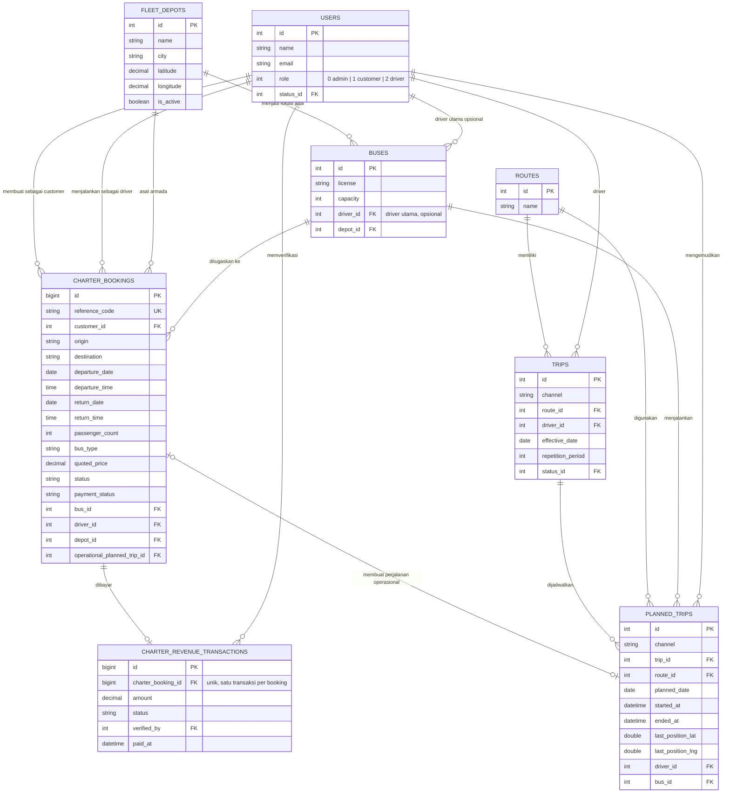
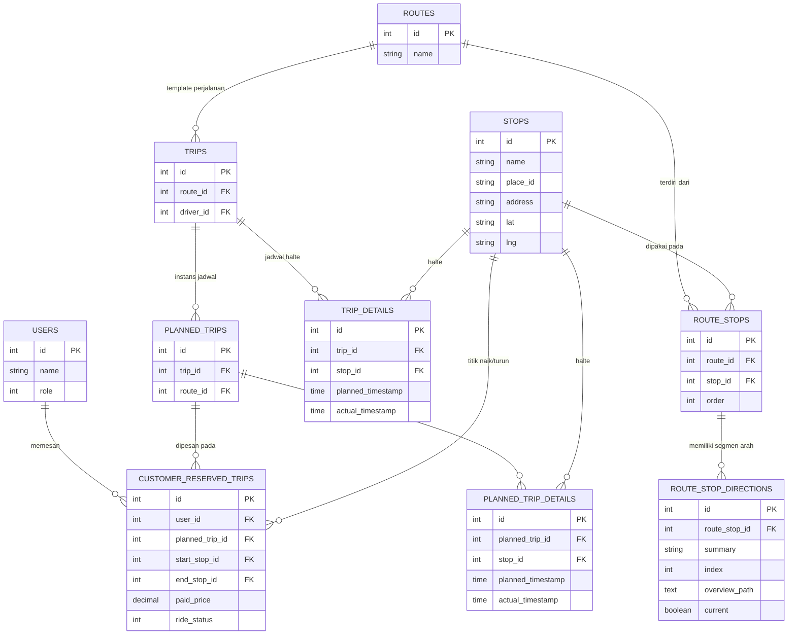
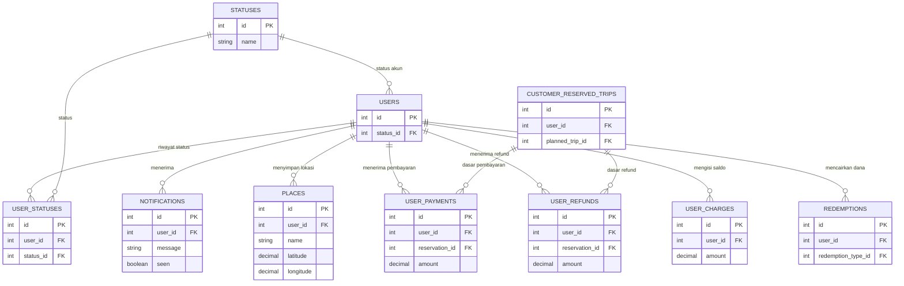

# ERD EZBus Admin Panel

Dokumen ini dibuat dari migration database proyek pada 29 Juli 2026. Diagram menggunakan [Mermaid ER Diagram](https://mermaid.js.org/syntax/entityRelationshipDiagram.html), sehingga dapat dirender di GitHub, GitLab, atau Mermaid Live Editor.

## 1. Inti charter, armada, pendapatan, dan tracking



Catatan penting: lokasi GPS terakhir tersimpan di `planned_trips.last_position_lat` dan `planned_trips.last_position_lng`. Nilai pendapatan dashboard charter dibaca dari `charter_revenue_transactions` dengan `status = paid`, bukan dari booking yang hanya berstatus disetujui.

## 2. Rute reguler dan reservasi penumpang



## 3. Akun, notifikasi, dan keuangan reguler



## Ringkasan alur charter

```text
Customer (users)
  -> charter_bookings
  -> pembayaran diverifikasi
  -> charter_revenue_transactions
  -> admin menetapkan bus + driver + depo
  -> planned_trips
  -> GPS driver tersimpan dan dikirim ke Live Tracking
```
