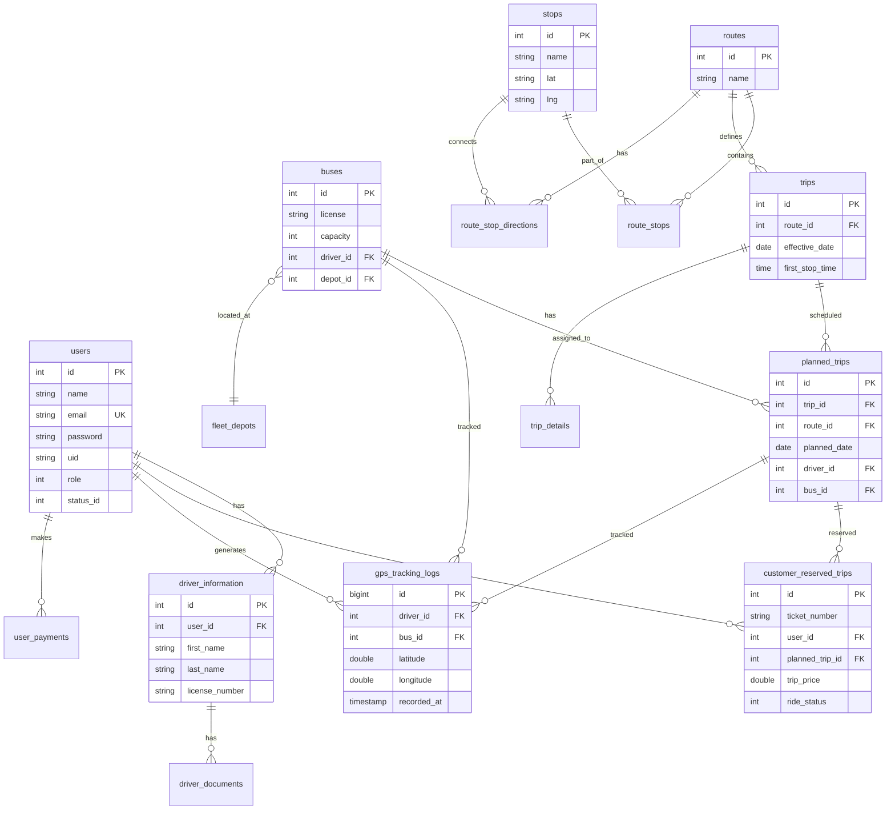

# Perancangan Tabel Basis Data - Sistem EZBus

## Daftar Isi
1. [Ikhtisar](#ikhtisar)
2. [D1: Akun (Users/Accounts)](#d1-akun)
3. [D2: Armada Bus (Bus Fleet)](#d2-armada-bus)
4. [D3: Data Driver](#d3-data-driver)
5. [D4: Rute & Tarif](#d4-rute--tarif)
6. [D5: Transaksi Booking](#d5-transaksi-booking)
7. [D6: Log Tracking](#d6-log-tracking)
8. [ERD (Entity Relationship Diagram)](#erd)
9. [Tabel Baru yang Perlu Dibuat](#tabel-baru)

---

## Ikhtisar

Sistem EZBus menggunakan database MySQL dengan nama `ezbus_db`. Berikut adalah mapping antara Data Store pada DFD dengan tabel yang ada di database:

| Data Store | Keterangan | Tabel Utama |
|------------|------------|-------------|
| D1: Akun | Data pengguna sistem | `users`, `user_statuses`, `driver_information` |
| D2: Armada Bus | Data armada bus | `buses`, `fleet_depots` |
| D3: Data Driver | Data driver | `users` (role=2), `driver_information`, `driver_documents` |
| D4: Rute & Tarif | Data rute dan harga | `routes`, `stops`, `route_stops`, `trips`, `trip_details` |
| D5: Transaksi Booking | Data pemesanan | `customer_reserved_trips`, `charter_bookings`, `user_payments` |
| D6: Log Tracking | Log GPS tracking | **Belum ada (perlu dibuat)** |

---

## D1: Akun

### Tabel: `users`

Menyimpan data semua pengguna sistem (Admin, Customer, Driver).

| Kolom | Tipe | Keterangan |
|-------|------|------------|
| `id` | INT (PK) | ID unik pengguna |
| `name` | VARCHAR | Nama lengkap |
| `email` | VARCHAR (UNIQUE) | Email pengguna |
| `email_verified_at` | TIMESTAMP | Waktu verifikasi email |
| `password` | VARCHAR | Password hash |
| `uid` | VARCHAR | Firebase UID |
| `fcm_token` | VARCHAR | Token Firebase Cloud Messaging |
| `avatar` | VARCHAR | Nama file avatar |
| `tel_number` | VARCHAR | Nomor telepon |
| `address` | VARCHAR | Alamat |
| `license_url` | VARCHAR | URL SIM (untuk driver) |
| `wallet` | DOUBLE | Saldo dompet |
| `status_id` | INT (FK) | Status pengguna (1=active, 2=pending, 3=suspended) |
| `role` | INT | Peran (0=admin, 1=customer, 2=driver) |
| `redemption_preference` | INT | Preferensi pencairan (1=cash, 2=bank, 3=paypal, 4=mobile money) |
| `created_at` | TIMESTAMP | Waktu pembuatan |
| `updated_at` | TIMESTAMP | Waktu update |

### Tabel: `user_statuses`

Menyimpan status pengguna.

| Kolom | Tipe | Keterangan |
|-------|------|------------|
| `id` | INT (PK) | ID status |
| `name` | VARCHAR | Nama status |
| `created_at` | TIMESTAMP | Waktu pembuatan |
| `updated_at` | TIMESTAMP | Waktu update |

---

## D2: Armada Bus

### Tabel: `buses`

Menyimpan data armada bus.

| Kolom | Tipe | Keterangan |
|-------|------|------------|
| `id` | INT (PK) | ID unik bus |
| `license` | VARCHAR | Nomor polisi |
| `capacity` | INT | Kapasitas penumpang |
| `driver_id` | INT (FK) | ID driver (ke tabel `users`) |
| `depot_id` | INT (FK) | ID depot (ke tabel `fleet_depots`) |
| `price_factor` | DOUBLE | Faktor pengali harga |
| `seat_configuration` | JSON | Konfigurasi kursi |
| `created_at` | TIMESTAMP | Waktu pembuatan |
| `updated_at` | TIMESTAMP | Waktu update |

### Tabel: `fleet_depots`

Menyimpan data depot/garasi bus.

| Kolom | Tipe | Keterangan |
|-------|------|------------|
| `id` | INT (PK) | ID unik depot |
| `name` | VARCHAR | Nama depot |
| `address` | VARCHAR | Alamat depot |
| `lat` | DOUBLE | Latitude |
| `lng` | DOUBLE | Longitude |
| `created_at` | TIMESTAMP | Waktu pembuatan |
| `updated_at` | TIMESTAMP | Waktu update |

---

## D3: Data Driver

### Tabel: `driver_information`

Menyimpan data detail driver.

| Kolom | Tipe | Keterangan |
|-------|------|------------|
| `id` | INT (PK) | ID unik |
| `user_id` | INT (FK) | ID user (ke tabel `users`) |
| `first_name` | VARCHAR | Nama depan |
| `last_name` | VARCHAR | Nama belakang |
| `phone_number` | VARCHAR | Nomor telepon |
| `address` | VARCHAR | Alamat |
| `email` | VARCHAR | Email |
| `license_number` | VARCHAR | Nomor SIM |
| `response` | TEXT | Respon tambahan (JSON) |
| `created_at` | TIMESTAMP | Waktu pembuatan |
| `updated_at` | TIMESTAMP | Waktu update |

### Tabel: `driver_documents`

Menyimpan dokumen driver (SIM, KTP, dll).

| Kolom | Tipe | Keterangan |
|-------|------|------------|
| `id` | INT (PK) | ID unik |
| `driver_id` | INT (FK) | ID driver (ke tabel `driver_information`) |
| `document_type` | VARCHAR | Jenis dokumen |
| `document_url` | VARCHAR | URL file dokumen |
| `created_at` | TIMESTAMP | Waktu pembuatan |
| `updated_at` | TIMESTAMP | Waktu update |

---

## D4: Rute & Tarif

### Tabel: `routes`

Menyimpan data rute perjalanan.

| Kolom | Tipe | Keterangan |
|-------|------|------------|
| `id` | INT (PK) | ID unik rute |
| `name` | VARCHAR | Nama rute |
| `deleted_at` | TIMESTAMP | Soft delete |
| `created_at` | TIMESTAMP | Waktu pembuatan |
| `updated_at` | TIMESTAMP | Waktu update |

### Tabel: `stops`

Menyimpan data titik berhenti/stasiun.

| Kolom | Tipe | Keterangan |
|-------|------|------------|
| `id` | INT (PK) | ID unik stop |
| `name` | VARCHAR | Nama stop |
| `place_id` | VARCHAR | Google Place ID |
| `address` | VARCHAR | Alamat |
| `lat` | VARCHAR | Latitude |
| `lng` | VARCHAR | Longitude |
| `created_at` | TIMESTAMP | Waktu pembuatan |
| `updated_at` | TIMESTAMP | Waktu update |

### Tabel: `route_stops`

Menyimpan urutan stop dalam sebuah rute.

| Kolom | Tipe | Keterangan |
|-------|------|------------|
| `id` | INT (PK) | ID unik |
| `route_id` | INT (FK) | ID rute (ke tabel `routes`) |
| `stop_id` | INT (FK) | ID stop (ke tabel `stops`) |
| `sequence` | INT | Urutan stop |
| `created_at` | TIMESTAMP | Waktu pembuatan |
| `updated_at` | TIMESTAMP | Waktu update |

### Tabel: `route_stop_directions`

Menyimpan informasi arah/jarak antar stop.

| Kolom | Tipe | Keterangan |
|-------|------|------------|
| `id` | INT (PK) | ID unik |
| `route_id` | INT (FK) | ID rute |
| `from_stop_id` | INT (FK) | ID stop asal |
| `to_stop_id` | INT (FK) | ID stop tujuan |
| `distance` | DOUBLE | Jarak (km) |
| `duration` | INT | Durasi (menit) |
| `overview_path` | TEXT | Path koordinat Google Maps |
| `created_at` | TIMESTAMP | Waktu pembuatan |
| `updated_at` | TIMESTAMP | Waktu update |

### Tabel: `trips`

Menyimpan jadwal perjalanan.

| Kolom | Tipe | Keterangan |
|-------|------|------------|
| `id` | INT (PK) | ID unik trip |
| `channel` | VARCHAR | Channel/agen |
| `route_id` | INT (FK) | ID rute |
| `effective_date` | DATE | Tanggal berlaku |
| `repetition_period` | INT | Periode pengulangan (hari, 0=tidak berulang) |
| `stop_to_stop_avg_time` | INT | Rata-rata waktu antar stop (menit) |
| `first_stop_time` | TIME | Waktu keberangkatan pertama |
| `last_stop_time` | TIME | Waktu keberangkatan terakhir |
| `status_id` | INT (FK) | Status trip |
| `driver_id` | INT (FK) | ID driver |
| `created_at` | TIMESTAMP | Waktu pembuatan |
| `updated_at` | TIMESTAMP | Waktu update |

### Tabel: `trip_details`

Menyimpan detail harga per segmen rute.

| Kolom | Tipe | Keterangan |
|-------|------|------------|
| `id` | INT (PK) | ID unik |
| `trip_id` | INT (FK) | ID trip |
| `from_stop_id` | INT (FK) | ID stop asal |
| `to_stop_id` | INT (FK) | ID stop tujuan |
| `price` | DOUBLE | Harga tiket |
| `created_at` | TIMESTAMP | Waktu pembuatan |
| `updated_at` | TIMESTAMP | Waktu update |

---

## D5: Transaksi Booking

### Tabel: `customer_reserved_trips`

Menyimpan data pemesanan tiket oleh customer.

| Kolom | Tipe | Keterangan |
|-------|------|------------|
| `id` | INT (PK) | ID unik booking |
| `ticket_number` | VARCHAR | Nomor tiket |
| `user_id` | INT (FK) | ID customer |
| `planned_trip_id` | INT (FK) | ID trip terjadwal |
| `reservation_date` | DATE | Tanggal reservasi |
| `start_stop_id` | INT (FK) | ID stop asal |
| `end_stop_id` | INT (FK) | ID stop tujuan |
| `end_point_lat` | DOUBLE | Latitude tujuan |
| `end_point_lng` | DOUBLE | Longitude tujuan |
| `start_address` | TEXT | Alamat asal |
| `destination_address` | TEXT | Alamat tujuan |
| `planned_start_time` | TIME | Waktu keberangkatan |
| `trip_price` | DOUBLE | Harga tiket |
| `paid_price` | DOUBLE | Harga yang dibayar |
| `driver_share` | DOUBLE | Bagian driver |
| `admin_share` | DOUBLE | Bagian admin |
| `ride_status` | INT | Status (0=belum, 1=naik, 2=terlewat, 3=turun, 4=batal) |
| `payment_method` | INT | Metode pembayaran |
| `seat_number` | VARCHAR | Nomor kursi |
| `created_at` | TIMESTAMP | Waktu pembuatan |
| `updated_at` | TIMESTAMP | Waktu update |

### Tabel: `charter_bookings`

Menyimpan data pemesanan charter bus.

| Kolom | Tipe | Keterangan |
|-------|------|------------|
| `id` | INT (PK) | ID unik booking |
| `booking_code` | VARCHAR | Kode booking |
| `customer_name` | VARCHAR | Nama pemesan |
| `customer_email` | VARCHAR | Email pemesan |
| `customer_phone` | VARCHAR | Telepon pemesan |
| `trip_date` | DATE | Tanggal perjalanan |
| `trip_time` | TIME | Waktu perjalanan |
| `pickup_location` | VARCHAR | Lokasi jemput |
| `dropoff_location` | VARCHAR | Lokasi antar |
| `distance` | DOUBLE | Jarak (km) |
| `duration` | INT | Durasi (menit) |
| `bus_id` | INT (FK) | ID bus |
| `driver_id` | INT (FK) | ID driver |
| `depot_id` | INT (FK) | ID depot |
| `total_price` | DOUBLE | Total harga |
| `payment_status` | VARCHAR | Status pembayaran |
| `booking_status` | VARCHAR | Status booking |
| `created_at` | TIMESTAMP | Waktu pembuatan |
| `updated_at` | TIMESTAMP | Waktu update |

### Tabel: `user_payments`

Menyimpan data pembayaran.

| Kolom | Tipe | Keterangan |
|-------|------|------------|
| `id` | INT (PK) | ID unik |
| `user_id` | INT (FK) | ID pengguna |
| `amount` | DOUBLE | Jumlah bayar |
| `payment_method` | VARCHAR | Metode pembayaran |
| `transaction_id` | VARCHAR | ID transaksi |
| `status` | VARCHAR | Status pembayaran |
| `created_at` | TIMESTAMP | Waktu pembuatan |
| `updated_at` | TIMESTAMP | Waktu update |

---

## D6: Log Tracking

### ⚠️ TABEL BARU - Belum Ada di Database

Tabel ini perlu dibuat untuk menyimpan log GPS tracking secara real-time.

### Tabel: `gps_tracking_logs`

| Kolom | Tipe | Keterangan |
|-------|------|------------|
| `id` | BIGINT (PK) | ID unik |
| `driver_id` | INT (FK) | ID driver (ke tabel `users`) |
| `bus_id` | INT (FK) | ID bus (ke tabel `buses`) |
| `planned_trip_id` | INT (FK) | ID trip (ke tabel `planned_trips`) |
| `latitude` | DOUBLE | Latitude posisi |
| `longitude` | DOUBLE | Longitude posisi |
| `speed` | DOUBLE | Kecepatan (km/jam) |
| `heading` | DOUBLE | Arah pergerakan (derajat) |
| `accuracy` | DOUBLE | Akurasi GPS (meter) |
| `recorded_at` | TIMESTAMP | Waktu pencatatan |
| `created_at` | TIMESTAMP | Waktu pembuatan |

**Indeks:**
- `idx_driver_id` pada kolom `driver_id`
- `idx_bus_id` pada kolom `bus_id`
- `idx_recorded_at` pada kolom `recorded_at`
- `idx_trip_id` pada kolom `planned_trip_id`

---

## ERD



---

## Tabel Baru yang Perlu Dibuat

### Migration: `create_gps_tracking_logs_table`

```php
<?php

use Illuminate\Database\Migrations\Migration;
use Illuminate\Database\Schema\Blueprint;
use Illuminate\Support\Facades\Schema;

return new class extends Migration
{
    public function up()
    {
        Schema::create('gps_tracking_logs', function (Blueprint $table) {
            $table->bigIncrements('id');
            
            $table->unsignedInteger('driver_id');
            $table->foreign('driver_id')->references('id')->on('users')->onDelete('cascade');
            
            $table->unsignedInteger('bus_id')->nullable();
            $table->foreign('bus_id')->references('id')->on('buses')->onDelete('set null');
            
            $table->unsignedInteger('planned_trip_id')->nullable();
            $table->foreign('planned_trip_id')->references('id')->on('planned_trips')->onDelete('set null');
            
            $table->double('latitude');
            $table->double('longitude');
            $table->double('speed')->nullable();
            $table->double('heading')->nullable();
            $table->double('accuracy')->nullable();
            
            $table->timestamp('recorded_at');
            
            $table->timestamps();
            
            // Indexes untuk performa query
            $table->index('driver_id');
            $table->index('bus_id');
            $table->index('recorded_at');
            $table->index('planned_trip_id');
        });
    }

    public function down()
    {
        Schema::dropIfExists('gps_tracking_logs');
    }
};
```

### Model: `GpsTrackingLog.php`

```php
<?php

namespace App\Models;

use Illuminate\Database\Eloquent\Model;

class GpsTrackingLog extends Model
{
    protected $fillable = [
        'driver_id',
        'bus_id',
        'planned_trip_id',
        'latitude',
        'longitude',
        'speed',
        'heading',
        'accuracy',
        'recorded_at',
    ];

    protected $casts = [
        'latitude' => 'double',
        'longitude' => 'double',
        'speed' => 'double',
        'heading' => 'double',
        'accuracy' => 'double',
        'recorded_at' => 'datetime',
    ];

    public function driver()
    {
        return $this->belongsTo(User::class, 'driver_id');
    }

    public function bus()
    {
        return $this->belongsTo(Bus::class);
    }

    public function plannedTrip()
    {
        return $this->belongsTo(PlannedTrip::class);
    }
}
```

---

## Ringkasan

| No | Tabel | Keterangan | Status |
|----|-------|------------|--------|
| 1 | `users` | Data pengguna | ✅ Ada |
| 2 | `user_statuses` | Status pengguna | ✅ Ada |
| 3 | `buses` | Data bus | ✅ Ada |
| 4 | `fleet_depots` | Data depot | ✅ Ada |
| 5 | `driver_information` | Info driver | ✅ Ada |
| 6 | `driver_documents` | Dokumen driver | ✅ Ada |
| 7 | `routes` | Data rute | ✅ Ada |
| 8 | `stops` | Data stop | ✅ Ada |
| 9 | `route_stops` | Rute-stop | ✅ Ada |
| 10 | `route_stop_directions` | Arah antar stop | ✅ Ada |
| 11 | `trips` | Jadwal trip | ✅ Ada |
| 12 | `trip_details` | Detail harga | ✅ Ada |
| 13 | `planned_trips` | Trip terjadwal | ✅ Ada |
| 14 | `customer_reserved_trips` | Reservasi | ✅ Ada |
| 15 | `charter_bookings` | Pemesanan charter | ✅ Ada |
| 16 | `user_payments` | Pembayaran | ✅ Ada |
| 17 | `gps_tracking_logs` | Log GPS | ⚠️ **Perlu Dibuat** |

---

*Dokumen ini dibuat berdasarkan DFD Sistem EZBus*
*Terakhir diperbarui: 29 Juli 2026*
